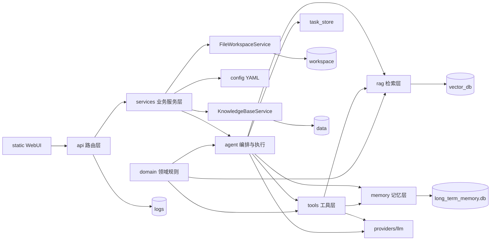

# GeoClaw-LS 目标架构（面向后续 Agent 开发）

> 说明：本文档用于定义“目标结构与迁移方向”，当前阶段**只做结构设计，不移动现有代码**。迁移遵循兼容优先、渐进收敛、可回滚原则。

## 1. 推荐目标结构

建议在现有仓库基础上逐步收敛为以下职责边界（目录名为目标形态，不要求一次到位）：

```text
GeoClaw-LS/
├─ api/                     # FastAPI 路由层（chat/sessions/files/tasks/kb/config/observability/health）
├─ agent/                   # Agent 运行态、LangGraph 编排、executor/planner/reviewer/task_store
├─ tools/                   # 统一工具协议、工具注册、内置工具、数据分析工具
├─ rag/                     # 知识加载、切块、向量库、检索、重排、检索质量评估
├─ memory/                  # 会话数据库、摘要记忆、用户偏好、历史查询
├─ services/                # 面向 API 的业务服务（AgentService/KnowledgeBaseService/FileWorkspaceService/ConfigService）
├─ providers/               # LLM Provider 封装（Ollama + 未来 OpenAI-compatible）
├─ domain/                  # 地质灾害领域规则（术语词典、InSAR 修正、专业提示词策略）
├─ static/                  # 当前原生 WebUI（阶段性保留，后续再模块化）
├─ config/                  # YAML 配置与提示词（继续外置）
├─ data/                    # 知识库原始资料（本地资产）
├─ workspace/               # 上传文件与分析产物（运行数据）
├─ vector_db/               # 向量索引持久化（运行数据）
└─ logs/                    # 日志与诊断（运行数据）
```

### 1.1 `api/` 路由层
- 仅负责 HTTP 入参校验、响应序列化、错误码映射与鉴权扩展点预留。
- 推荐拆分为：`chat.py`、`sessions.py`、`files.py`、`tasks.py`、`kb.py`、`config.py`、`observability.py`、`health.py`。
- 禁止在路由层直接拼接复杂业务流程，统一委托给 `services/`。

### 1.2 `agent/` 运行编排层
- 聚焦 Agent 任务生命周期：`planner -> decision -> executor -> solver/reviewer`。
- 与 `task_store` 协同维护步骤状态、产物、执行轨迹。
- 对外暴露稳定的运行接口，避免 API 层耦合内部数据结构。

### 1.3 `tools/` 工具层
- 统一 `ToolInput/ToolResult/BaseTool` 协议与注册机制。
- 收敛内置工具（RAG/MEMORY/LLM/CALCULATOR/DISCOVERY）与数据类工具（FILE_INSPECTOR/DATA_PROFILE）。
- 新工具接入应遵循“注册即可用”，避免多处硬编码工具名。

### 1.4 `rag/` 检索层
- 承担从资料入库到检索输出的完整链路：加载、切块、索引、召回、重排、质量评估。
- 与 `knowledge/`、`memory/vector_store` 的历史职责逐步收敛，最终形成单一检索边界。
- 对上层输出标准化检索结果与质量指标，支持重规划策略判定。

### 1.5 `memory/` 记忆层
- 负责会话数据库、摘要记忆、偏好抽取、历史检索。
- 与 `agent/` 的边界：`memory` 提供状态与查询能力，`agent` 负责流程编排与策略决策。

### 1.6 `services/` 业务服务层
- 面向 API 提供稳定业务能力，不暴露底层实现细节。
- 推荐服务：
- `AgentService`：问答入口、任务提交、任务状态查询。
- `KnowledgeBaseService`：同步、重建、状态与诊断。
- `FileWorkspaceService`：上传、索引、产物下载与路径安全。
- `ConfigService`：配置读取、校验、写回、热更新策略。

### 1.7 `providers/`（或 `llm/`）模型提供方层
- 屏蔽 Ollama 与 OpenAI-compatible 差异（同步/异步/流式/重试/超时）。
- 统一上游调用契约，避免业务层分散判断 provider。
- 为后续多模型路由与降级策略预留扩展点。

### 1.8 `domain/` 领域规则层
- 集中管理地质灾害专业规则：术语白名单、InSAR 修正、提示词策略、引用约束。
- 避免术语修正规则散落在 `core`、`prompts` 与执行后处理逻辑中。

### 1.9 `static/` 与 `config/`
- `static/` 当前原生 WebUI 保留，不在本阶段重构为前端工程化目录。
- `config/` 继续外置 YAML（运行参数 + 提示词），保障可编辑与可迁移。

### 1.10 运行数据与源码边界
- `data/`、`workspace/`、`vector_db/`、`logs/` 明确定义为运行数据或本地资产。
- 这些目录与源代码目录解耦，避免被误当作业务模块进行重构。

## 2. 为什么不建议一次性改成 `src/` 大迁移

当前阶段不建议进行一次性 `src/` 目录大迁移，主要原因如下：

1. 现有导入路径大量直接引用 `core/`、`memory/`、`knowledge/` 等目录，整体迁移会触发广泛 import 变更，回归面过大。
2. 工作区当前已有较多未提交改动，叠加大迁移会显著提高冲突与回滚成本，不利于稳定迭代。
3. 现阶段优先级应是“保兼容、收敛边界、增加测试与验证链路”，而不是先做高扰动目录重排。
4. 在接口契约、工具协议、任务模型尚在演进期时，先做大迁移容易把结构风险与行为风险叠加。

结论：先做“低风险结构收敛”，待接口稳定后再评估是否引入 `src/` 布局。

## 3. 分阶段迁移策略

### Phase A：路由拆分（保留 `app.py` 兼容入口）
- 目标：把路由按领域拆入 `api/`，但 `app.py` 继续作为启动入口与兼容层。
- 输出：`app.py` 只做应用组装、生命周期与路由挂载；现有接口路径与响应字段保持兼容。
- 风险控制：先拆低耦合路由（health/config/observability），再拆 chat/tasks/files。

### Phase B：工具协议统一（消除 `core/tools.py` 与 `tools/` 双轨）
- 目标：以 `tools/` 为唯一工具执行入口，`core/tools.py` 降级为兼容代理并逐步清空。
- 输出：工具注册单点化，`AgentExecutor` 不再维护特例执行分支，新增工具只需实现协议并注册。
- 风险控制：保留过渡期兼容映射，按工具逐个切换并做回归。

### Phase C：RAG 边界收敛（逐步纳入 `rag/`）
- 目标：将 `knowledge/` 与 `memory/vector_store.py` 涉及的检索职责逐步收敛到 `rag/`。
- 输出：`rag/` 成为检索主边界，外部通过稳定接口调用；历史目录保留薄兼容层。
- 风险控制：先统一接口与结果结构，再迁移实现，避免“接口与实现同时变更”。

### Phase D：服务层与任务队列预留（面向长任务）
- 目标：构建 `services/`，并为后台长任务、多文件分析、任务重试预留能力。
- 输出：支持“提交任务-异步执行-状态查询-产物回收”的通道；任务模型支持重试与失败恢复。
- 风险控制：先引入队列抽象与状态机字段，不强制立即替换现有同步路径。

## 4. Mermaid 组件关系图



## 5. 迁移执行原则（补充）

- 兼容优先：先保接口、再换内部实现。
- 小步提交：每阶段都应可单独回滚。
- 可验证：每次结构调整都绑定最小回归清单（聊天、任务、上传、检索、配置、观测）。
- 数据隔离：运行数据目录不参与源码重构动作，不做目录挪移。
