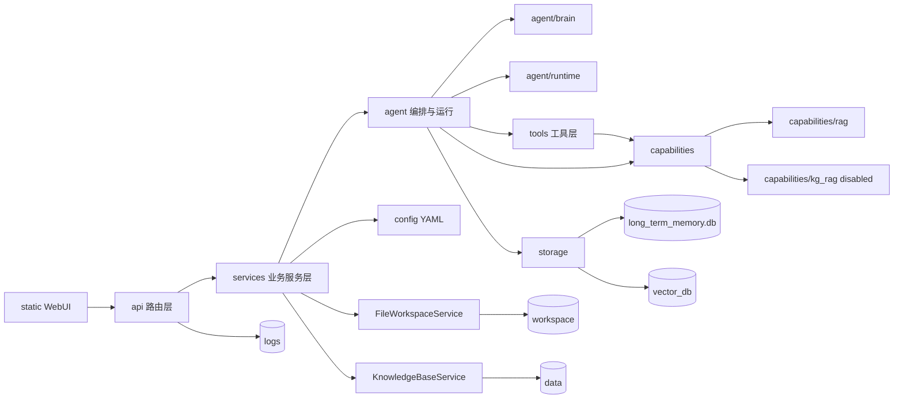

# GeoClaw-LS 目标架构（现状同步版）

> 说明：本文档用于定义“目标结构 + 当前落地状态 + 下一步执行清单”。  
> 迁移遵循：兼容优先、渐进收敛、可回滚、可验证。
>
> 当前稳定规则（已执行）：
> - 新代码优先使用 `capabilities/`、`storage/`、`services/`、`agent/brain`、`agent/runtime`。
> - 兼容层目录 `rag/`、`knowledge/`、`memory/` 已完成独立清理 PR 删除。
> - 旧导入路径已下线；新增代码与外部脚本应统一使用主实现路径。
> - 运行数据目录（`workspace/`、`vector_db/`、`logs/`、`*.db`）不参与源码重构。

> 当前迁移事实源：`docs/migration_status.md`。  
> `docs/archive/compatibility_layers.md` 为删除前迁移说明的历史文档，不作为当前状态判定依据。

## 1. 目标结构与职责边界（保持不变）

```text
GeoClaw-LS/
├─ api/                     # FastAPI 路由层（chat/sessions/files/tasks/kb/config/observability/health）
├─ services/                # 面向 API 的业务服务层（路由只做校验/映射，服务承接业务编排）
├─ agent/                   # Agent 编排与运行态（brain/runtime/executor/task_store/task_runner）
├─ tools/                   # 统一工具协议、工具注册、内置工具与数据工具
├─ capabilities/            # 能力边界（rag 默认启用，kg_rag 默认禁用，automl 占位）
├─ storage/                 # 统一存储边界（sqlite/vector/artifacts/graph 适配）
├─ providers/               # 模型提供方抽象（当前以本地 Ollama 为主）
├─ domain/                  # 地质灾害领域规则（术语、InSAR 修正、提示词策略等）
├─ static/                  # 原生 WebUI（阶段性保留）
├─ config/                  # 外置 YAML 配置与提示词
├─ data/                    # 知识库原始资料（本地资产）
├─ workspace/               # 上传文件与分析产物（运行数据）
├─ vector_db/               # 向量索引持久化（运行数据）
└─ logs/                    # 日志与诊断（运行数据）
```

### 1.1 `api/` 路由层
- 只负责 HTTP 入参校验、响应序列化、错误码映射，不直接拼接复杂业务。
- 已按领域拆分为 chat/sessions/files/tasks/kb/config/observability/health 路由。
- 统一委托 `services/`，保持对外 API 路径和响应字段兼容。

### 1.2 `services/` 业务服务层
- 对 `api/` 提供稳定业务入口，隔离底层实现细节。
- 当前已形成 `AgentService`、`TaskService`、`KnowledgeBaseService`、`FileWorkspaceService`、`ConfigService`、`ObservabilityService`、`SessionService` 等服务边界。
- 新业务优先落在服务层，不回灌到路由层或临时脚本逻辑。

### 1.3 `agent/` 编排与运行层
- 工作流主链：`planner -> decision -> executor -> solver -> reviewer`。
- `agent/brain` 承担规划、决策、综合回答、审核等“推理门面”。
- `agent/runtime` 承担运行入口与持久化辅助，不承载具体能力实现。

### 1.4 `tools/` + `capabilities/`
- `tools/` 提供 `ToolInput/ToolResult/BaseTool` 协议和统一注册机制。
- `capabilities/` 提供能力声明与工具合并边界：默认启用 RAG，`kg_rag` 默认禁用，`automl` 占位。
- 默认工具集合保持稳定，不因实验能力而破坏主链路兼容。

### 1.5 `storage/` + 兼容层
- `storage/` 作为统一存储边界，当前为薄适配，不改真实 SQLite/Chroma schema。
- 兼容层目录 `memory/`、`knowledge/`、`rag/` 已删除；主链路已统一切换至 `capabilities/` 与 `storage/`。
- 后续策略是“边界稳定 + 导入约束 + 变更可回滚”，避免重新引入历史路径耦合。

## 2. 现状对照（截至当前）

| 模块 | 目标状态 | 当前状态 | 结论 |
|---|---|---|---|
| API 分层 | 路由瘦身、服务承接业务 | 已拆分路由并接入服务层 | 已落地 |
| Brain 边界 | 推理职责门面化 | `agent/brain` 已接入主流程并保留回退 | 已落地 |
| Runtime 边界 | 运行门面 + 持久化辅助 | `agent/runtime` 已接入并兼容旧路径 | 已落地 |
| Capability 边界 | 能力显式注册 | RAG 启用，KG-RAG 骨架默认禁用 | 已落地（灰度态） |
| Storage 边界 | 统一存储适配 | `storage/` 已接入，未做数据迁移 | 已落地 |
| 兼容层治理 | 旧导入退场 | `rag/knowledge/memory` 目录已删除，导入已切换 | 已落地 |
| providers 抽象 | 支持多 provider | 当前运行仍以 Ollama-only 为主 | 待推进 |
| domain 规则层 | 规则集中管理 | 已有术语修正与提示词约束，需继续收敛 | 进行中 |

## 3. 不做事项（当前阶段）

- 不进行一次性 `src/` 大迁移，不做高扰动目录重排。
- 不在无回归验证前提下做跨层重构或路径大改。
- 不迁移或重写运行数据目录，不手动改写运行态资产文件。
- 不默认启用 `KG_RAG`、`AUTOML` 到 Planner 工具集合。

## 4. 下一阶段执行清单（工程版）

### 4.1 执行目标
- 在不破坏现有行为的前提下，继续“边界收敛 + 能力灰度 + 可观测增强”。
- 保持默认主链路稳定，新增能力通过显式开关逐步放量。

### 4.2 工作包（按优先级）

1. **兼容层收敛清单化**
- 将兼容导入映射固化到文档与开发规范（用于外部调用方迁移）。
- 增加导入约束检查（新增代码禁止出现历史路径依赖）。
- 维护“删除后观察期”问题清单，发现残余脚本调用时按映射快速修复。

2. **providers 抽象前置治理**
- 把 provider 差异约束在统一接口，业务层不直接判断 provider。
- 先补接口契约测试，再评估开启 OpenAI-compatible 路径。

3. **domain 规则集中化**
- 逐步把术语修正、提示词策略、引用约束收敛到 `domain/`。
- 避免规则散落在 `core/`、prompt 片段和后处理分支中。

4. **任务链路可观测增强**
- 强化任务失败原因、重试路径、步骤级产物和进度可解释性。
- 保持 `/api/tasks` 与前端工作台字段兼容。

### 4.3 每次改动的最小验收（必须执行）
- `python -m pytest` 全量通过。
- 手动回归最小清单：聊天、任务创建与查询、文件上传、`DATA_PROFILE` 产物下载、知识库状态/同步/重建、配置保存、观测开关。
- 变更影响说明：记录“本次变更边界、兼容策略、回滚点”。

### 4.4 回滚策略
- 单工作包单提交，禁止跨域大杂烩提交。
- 任一关键回归失败，直接回滚该工作包，不连带回滚已验证通过的包。
- 数据层与源码层分离回滚，避免对运行数据目录做破坏性操作。

## 5. 组件关系图（更新）



## 6. 迁移原则（持续有效）

- 兼容优先：先保接口与输出，再替换内部实现。
- 小步提交：每步都能独立验证和独立回滚。
- 行为不变：结构调整不引入对外语义变化。
- 先测后清：先完成全仓导入切换与回归，再执行目录清理与观察期验证。
